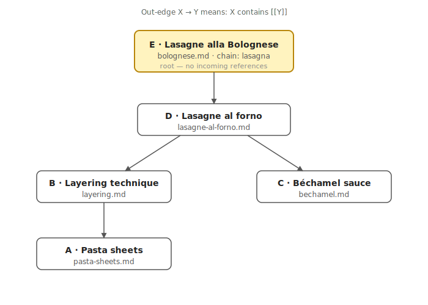

# Note Chain

"Note chain" is a plugin for Obsidian that addresses the issue:

> How to **easily add information** to a large personal knowledge base while **keeping it queryable**?

To easily add information, you could link each **new note** to the **last note on the same topic**. Notes on the same topic will natually form long sequences, a.k.a. **chains**. This plugin allows linking a new note in 2 clicks, even if your knowledge base contains thousands of notes collected over many years. And it can displays all notes in a chain so you can read them as a diary. That's all - it's simple.

A typical workflow is:
1. **Learn something interesting!**
2. **Write it down in a new note.** Don't waste effort on categorising it.
3. **When you have time, link it to another note on the same topic.** _Note chain_ has a command for that. It also displays all unlinked notes, so you won't forget.

## What is a note chain?

A **note chain** is a set of notes defined by a root: the chain contains the root and every note reachable from it through `[[wikilinks]]`. A **maximum-inclusion chain** is a chain not contained in any other chain — its root is what Note Chain surfaces.

The core writing habit is:

> If a new note is related to an existing chain, reference the last note in that chain.

Over time this grows a forest of chains rooted in your "north-star" notes — and the plugin keeps that forest within reach.

## Example: a small chain about lasagna

Imagine writing five notes while reading the [Wikipedia article on lasagna](https://en.wikipedia.org/wiki/Lasagna). The contents of each note:

**A — `pasta-sheets.md`**
```
Flat rectangular pasta sheets, the structural element of lasagna.
```

**B — `layering.md`**
```
Cooked [[pasta-sheets]] alternate with sauce and cheese in a stacked assembly.
```

**C — `bechamel.md`**
```
Milk thickened with a butter-and-flour roux, often seasoned with nutmeg.
```

**D — `lasagne-al-forno.md`**
```
Oven-baked lasagna: [[layering]] separated by a coat of [[bechamel]] between each layer.
```

**E — `bolognese.md`**
```
---
chain: lasagna
---
The Emilia-Romagna variant of [[lasagne-al-forno]], dressed with slow-cooked ragù bolognese.
```

The resulting reference graph:



Only `bolognese.md` (E) has no incoming references, so the side panel shows a single chain titled **lasagna** rooted at it. Opening *Thread view* on that root renders all five notes as one scrolling document. Adding a sixth note that references `[[bolognese]]` would make the new note the root and grow the chain.

## Features

- **Side panel** listing roots of maximum-inclusion chains, sorted by creation time (newest first). Chains untouched for more than 30 days fade to half opacity.
- **Cycle detection** — multi-note cycles in the reference graph render with a `↺` marker in red.
- **Thread view** — open any chain as a single scrolling document of all its rendered notes.
- **Link chain modal** — fuzzy-search chains by their `chain:` frontmatter title and insert a `[[wikilink]]` at the cursor.
- **Create successor** — spawn a new note that backlinks to the active one, following the chain workflow.
- **Tag indices** — *Refresh index* generates a managed index note per tag, plus a master index, so tag-based grouping is also navigable as a chain.
- **CLI** — the same queries from your shell: `list`, `get`, `create`, `list-notes`.
- **Claude Code skill** — `manage-notes` translates natural-language requests ("create a note in chain X") into CLI invocations.

## Install (Obsidian)

The plugin is not yet in the community registry. The easiest way to install it — and to receive auto-updates on every release — is via [BRAT](https://github.com/TfTHacker/obsidian42-brat):

1. Install **Obsidian42 - BRAT** from **Settings → Community plugins → Browse** and enable it.
2. Open **Settings → BRAT → Add Beta plugin** and paste:
   ```
   swalrus1/obsidian-note-chain
   ```
3. Confirm. BRAT downloads the latest release and enables Note Chain automatically. New releases are picked up by BRAT on Obsidian startup.

> [!TIP]
> The *Create successor* command delegates filename generation to Obsidian's built-in **Unique Note Creator** core plugin (or the community **ZK Prefixer** plugin). Enable one of them if you plan to use that command.

## Commands

| Command | What it does |
|---|---|
| `Open Note Chain` | Reveal the side panel in the right leaf. |
| `Link chain` | Fuzzy-search chains and insert a `[[wikilink]]` at the cursor. |
| `Create successor` | Create a new note that backlinks to the active one. |
| `Show thread view` | Open the active note's chain as a single scrolling thread. |
| `Refresh index` | Build / refresh a managed index note per tag, plus a master tag index. |

## CLI

The CLI gives you the same chain queries from a shell — useful for scripts, integrations, or any tool that isn't Obsidian itself. It runs against the vault directory directly; Obsidian doesn't need to be open.

### Build

```sh
just build-cli   # → cli/dist/cli.js
```

The CLI bundle is not shipped on tags; build it locally.

### Run

Point the CLI at your vault either with a flag or an environment variable:

```sh
export OBSIDIAN_VAULT=/path/to/vault
# …or pass --vault /path/to/vault on every invocation
```

### Commands

```sh
just cli list                          # YAML: {name, root_note} per chain
just cli get <name>                    # print the root note path for a chain
just cli create <parent-note-path>     # create a successor that backlinks to <parent>
just cli list-notes <root-note-path>   # print every note in the chain (BFS from root)
```

`get` matches the chain's `chain:` frontmatter exactly. If no title matches, it falls back to an exact match on the relative file path. Multiple matches fail with the candidate list. Basename is not used as an identifier.

`create` mirrors the plugin's *Create successor* workflow: it writes `YYYYMMDDHHMMSS.md` at the vault root (with a `-N` suffix on collision) and seeds the body with `[[<parent-basename>]]\n`.

> [!TIP]
> Exit codes: `0` success, `1` usage error, `2` not found / ambiguous, `3` I/O error. Stable enough to drive `&&`/`||` in shell pipelines.

## Claude Code skill: `manage-notes`

A natural-language frontend over the CLI. Ask in plain English; the skill resolves chain references, invokes the right CLI commands, and emits one relative note path per line on stdout.

### Install

```sh
export OBSIDIAN_VAULT=/path/to/vault
just install-skill   # symlinks skills/manage-notes into ~/.claude/skills/
```

### Examples

```
"list all chains"                      → every root note path
"what notes are in chain projects/q3"  → BFS over that chain
"create a note in topic algorithms"    → new note, prints its path
"get the root of chain my-project"     → the root's relative path
```

The skill treats *chain*, *topic*, *category*, *section*, *directory*, *area*, *thread*, *project* as synonyms.

> [!WARNING]
> The skill refuses anything that requires reading note contents — "summarize chain X", "what's in note Y", "find a note that mentions Z". Use the regular Claude Code tools for those.

## How it works

- A reference graph is built from Obsidian's resolved-link cache (`outLinks` / `inLinks`). The CLI builds the same shape from the filesystem by parsing wikilinks itself.
- An iterative **Kosaraju SCC** pass identifies *source SCCs* — strongly connected components with no incoming edges from other components. Single-node sources are root notes; multi-node sources are cycles (one alphabetically-first basename is picked as the cycle root).
- Chain titles come from a candidate-elimination algorithm over the `chain:` frontmatter field within each chain.

Pure logic lives in [`core/`](core/); Obsidian-specific glue is in [`src/`](src/); the CLI is in [`cli/`](cli/); the skill is in [`skills/`](skills/). See [`docs/premise.md`](docs/premise.md) for the workflow motivation and [`docs/architecture.md`](docs/architecture.md) for the code map.

## Development

```sh
just deps              # npm install
just dev               # watch-mode build of the plugin
just build             # production build (main.js)
just build-cli         # CLI bundle (cli/dist/cli.js)
just test              # run all vitest suites (plugin + core + CLI)
just update <vault>    # build and install into <vault>/.obsidian/plugins/note-chain/
```

Tests cover both the pure `core/` logic and the CLI end-to-end against ephemeral vaults created via `fs.mkdtempSync`.
